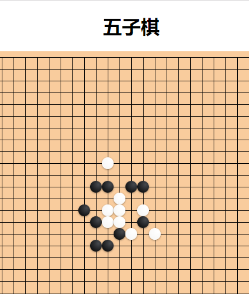
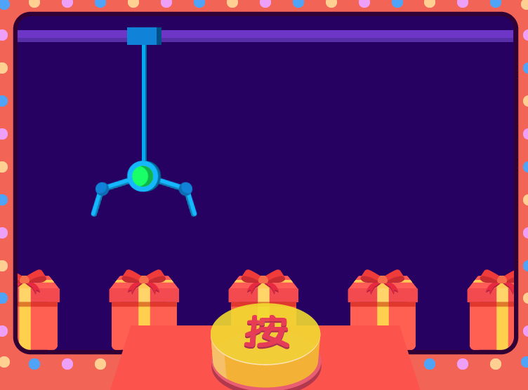
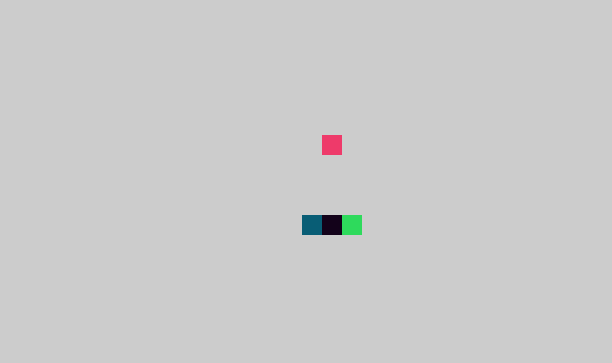

# 个人制作一些小游戏

> 目前一共写了4款游戏 -- 五子棋，娃娃机，老虎机，贪吃蛇

> 主要是加强自己的js功底，深入理解js原型继承，封装思想（分而治之，逐一击破），以及应用设计模式的思想到实际项目中

> 以下就是游戏截图

### [五子棋](https://jackluson.github.io/my-game/%E4%BA%94%E5%AD%90%E6%A3%8B/)

> 链接地址--https://jackluson.github.io/my-game/%E4%BA%94%E5%AD%90%E6%A3%8B/

### [娃娃机](https://jackluson.github.io/my-game/%E5%A8%83%E5%A8%83%E6%9C%BA/)

> 链接地址--https://jackluson.github.io/my-game/%E5%A8%83%E5%A8%83%E6%9C%BA/

### [贪婪的蛇](https://jackluson.github.io/my-game/%E8%B4%AA%E5%A9%AA%E7%9A%84%E8%9B%87/)

> 链接地址--https://jackluson.github.io/my-game/%E8%B4%AA%E5%A9%AA%E7%9A%84%E8%9B%87/

### [老虎机](https://jackluson.github.io/my-game/%E8%80%81%E8%99%8E%E6%9C%BA/)

> 链接地址--https://jackluson.github.io/my-game/%E8%80%81%E8%99%8E%E6%9C%BA/

> ps: 点击标题可进入游玩体验,游戏还有很多待提升的地方,目前只是打了一个整体,跑通一个流程